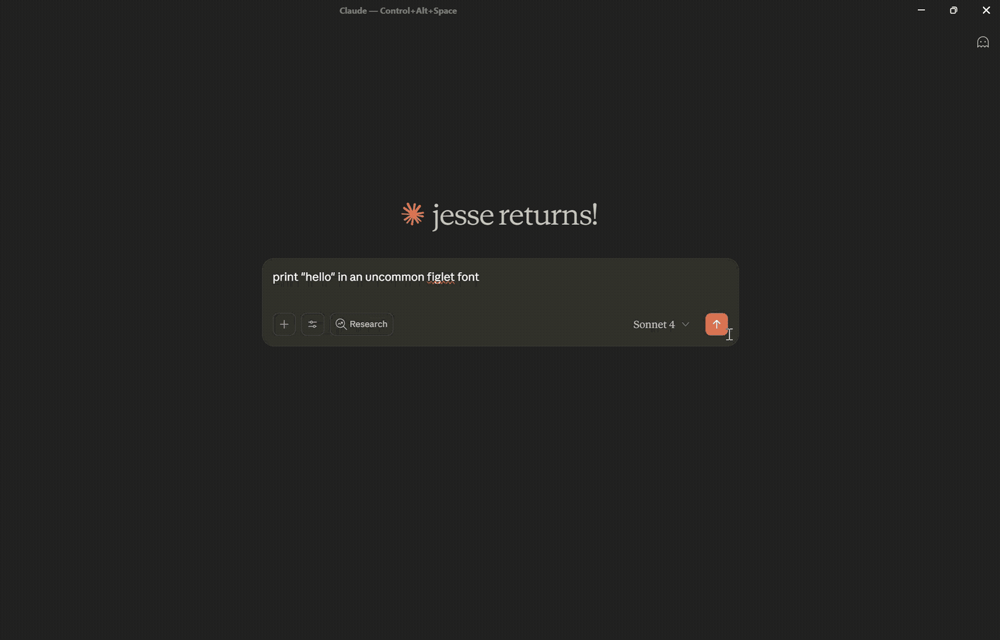

# TextArtTools MCP Server

[](https://opensource.org/licenses/MIT)
[](https://modelcontextprotocol.io/)
[](https://workers.cloudflare.com/)

**🌐 Live Server**: `https://mcp.textarttools.com`

Transform text with Unicode styles and create ASCII art banners. A production-ready Model Context Protocol (MCP) server deployed globally on Cloudflare Workers.

## 📺 Demo



## ✨ Features

- **23 Unicode Text Styles** - Transform text to 𝗯𝗼𝗹𝗱, 𝘪𝘵𝘢𝘭𝘪𝘤, 𝒸𝓊𝓇𝓈𝒾𝓋𝓮, 𝔣𝔯𝔞𝔨𝔱𝔲𝔯, and more
- **322+ ASCII Art Fonts** - Create stylized text banners for headers and decorations
- **No Authentication** - Public server ready to use immediately
- **Global Performance** - Deployed on Cloudflare Workers edge network
- **Rate Limited** - 100 requests per minute with burst protection
- **Secure** - Input validation, XSS prevention, and comprehensive security headers

## 🚀 Quick Start

### Install with Claude Desktop

1. Install the MCP remote proxy:
   ```bash
   npm install -g @anthropic/mcp-remote
   ```

2. Add to your Claude Desktop config (`claude_desktop_config.json`):
   ```json
   {
     "mcpServers": {
       "textarttools": {
         "command": "mcp-server",
         "args": ["https://mcp.textarttools.com/sse"]
       }
     }
   }
   ```

3. Restart Claude Desktop and start using text styling tools!

## 💡 Example Usage

Try the live API directly:

```bash
# Transform text to bold Unicode style
curl -X POST https://mcp.textarttools.com/sse \
  -H "Content-Type: application/json" \
  -d '{
    "jsonrpc": "2.0",
    "id": 1,
    "method": "tools/call",
    "params": {
      "name": "unicode_style_text",
      "arguments": {
        "text": "Hello World",
        "style": "bold"
      }
    }
  }'

# Create ASCII art banner
curl -X POST https://mcp.textarttools.com/sse \
  -H "Content-Type: application/json" \
  -d '{
    "jsonrpc": "2.0",
    "id": 2,
    "method": "tools/call",
    "params": {
      "name": "ascii_art_text",
      "arguments": {
        "text": "Hello",
        "font": "Big"
      }
    }
  }'
```

## 🛠️ Available Tools

The server provides 7 MCP tools:

**Unicode Text Styling:**
- `unicode_style_text` - Transform text with any of 23 Unicode styles
- `list_available_styles` - Get all available styles with examples
- `preview_styles` - Preview text in multiple styles
- `get_style_info` - Get detailed style information and compatibility

**ASCII Art Banners:**
- `ascii_art_text` - Generate stylized text banners with 322+ fonts
- `list_figlet_fonts` - Get all available fonts from R2 storage
- `preview_figlet_fonts` - Preview text in multiple fonts

Visit `https://mcp.textarttools.com/` for complete API documentation.

## 🏗️ Local Development

Want to run your own instance or contribute?

```bash
# Clone the repository
git clone https://github.com/humanjesse/textarttools-mcp.git
cd textarttools-mcp

# Install dependencies
npm install

# Create local environment file
cp .dev.vars.example .dev.vars
# Edit .dev.vars with your development values

# Start development server
npm run dev

# Test locally (server runs at http://localhost:8788)
curl -X POST http://localhost:8788/sse \
  -H "Content-Type: application/json" \
  -d '{"jsonrpc":"2.0","id":1,"method":"tools/list"}'
```

### Development Commands

```bash
npm run dev        # Start development server
npm run build      # Build for production
npm run deploy     # Deploy to Cloudflare Workers (requires auth)
npm run lint       # Check code quality
npm run typecheck  # Validate TypeScript
```

## 📖 Documentation

- **Live Server**: [https://mcp.textarttools.com](https://mcp.textarttools.com)
- **API Documentation**: [https://mcp.textarttools.com/](https://mcp.textarttools.com/) (AI-friendly)
- **Health Check**: [https://mcp.textarttools.com/health](https://mcp.textarttools.com/health)
- **MCP Protocol**: [Model Context Protocol Spec](https://modelcontextprotocol.io/)

## 🤝 Contributing

Contributions are welcome! Please see [CONTRIBUTING.md](CONTRIBUTING.md) for guidelines.

## 📝 License

MIT License - see [LICENSE](LICENSE) file for details.

---

**Built with [Model Context Protocol](https://modelcontextprotocol.io/) • Deployed on [Cloudflare Workers](https://workers.cloudflare.com/)**
