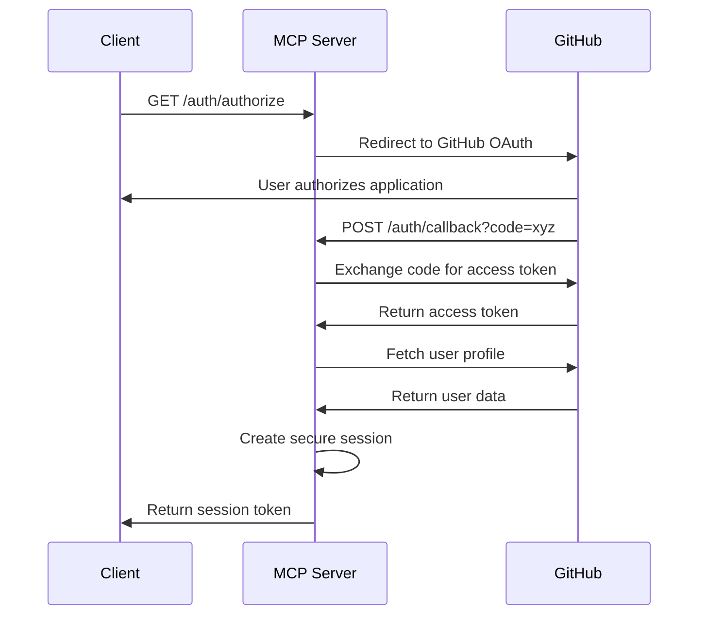

# Security Documentation
## TextArtTools MCP Server - Enterprise Security Architecture

[](./SECURITY.md)
[](./SECURITY.md)
[](./SECURITY.md)

---

## Table of Contents

1. [Security Overview](#security-overview)
2. [Security Architecture](#security-architecture)
3. [Core Security Features](#core-security-features)
4. [Authentication & Authorization](#authentication--authorization)
5. [Data Protection](#data-protection)
6. [Infrastructure Security](#infrastructure-security)
7. [Compliance & Governance](#compliance--governance)
8. [Security Configuration](#security-configuration)
9. [Threat Model](#threat-model)
10. [Security Monitoring](#security-monitoring)
11. [Incident Response](#incident-response)
12. [Security Best Practices](#security-best-practices)

---

## Security Overview

The TextArtTools MCP Server implements **enterprise-grade security** following **2025 Cloudflare Workers best practices**. Our multi-layered security approach provides comprehensive protection against modern threats while maintaining optimal performance.

### Security Principles

- **Defense in Depth**: Multiple layers of security controls
- **Zero Trust Architecture**: Never trust, always verify
- **Secure by Default**: Security-first configuration
- **Principle of Least Privilege**: Minimal necessary access
- **Continuous Monitoring**: Real-time threat detection
- **Compliance Ready**: SOC2, GDPR, and industry standards

### Security Levels

| Level | Use Case | Features |
|-------|----------|----------|
| **Strict** | Production environments | All security features enabled, maximum protection |
| **Standard** | Staging environments | Core security features with balanced performance |
| **Permissive** | Development environments | Essential security features for development |

---

## Security Architecture

### Multi-Layered Defense

```
┌─────────────────────────────────────────────────────────────┐
│                        Client Layer                         │
├─────────────────────────────────────────────────────────────┤
│  • HTTPS/TLS 1.3 Encryption                               │
│  • Client-side input validation                           │
│  • Content Security Policy enforcement                    │
└─────────────────────────────────────────────────────────────┘
                                │
                                ▼
┌─────────────────────────────────────────────────────────────┐
│                      Edge/CDN Layer                         │
├─────────────────────────────────────────────────────────────┤
│  • DDoS Protection (Cloudflare)                          │
│  • Geographic filtering                                   │
│  • Rate limiting at edge                                  │
│  • Bot detection and mitigation                          │
└─────────────────────────────────────────────────────────────┘
                                │
                                ▼
┌─────────────────────────────────────────────────────────────┐
│                   Application Gateway                       │
├─────────────────────────────────────────────────────────────┤
│  • Request signature validation (HMAC-SHA256)            │
│  • Security headers enforcement                          │
│  • CORS policy enforcement                               │
│  • Content type validation                               │
└─────────────────────────────────────────────────────────────┘
                                │
                                ▼
┌─────────────────────────────────────────────────────────────┐
│                   Application Layer                         │
├─────────────────────────────────────────────────────────────┤
│  • Input validation (allowlist-based)                    │
│  • Authentication & authorization                         │
│  • Session management                                     │
│  • Business logic security                               │
└─────────────────────────────────────────────────────────────┘
                                │
                                ▼
┌─────────────────────────────────────────────────────────────┐
│                      Data Layer                             │
├─────────────────────────────────────────────────────────────┤
│  • Output sanitization (context-aware)                   │
│  • Data encryption at rest                               │
│  • Audit logging with tamper protection                  │
│  • Secret rotation and management                        │
└─────────────────────────────────────────────────────────────┘
```

### Security Components Integration

Our security components work together to provide comprehensive protection:

1. **Input Validator** → Validates all incoming data against allowlists
2. **Text Sanitizer** → Provides context-aware output encoding
3. **Security Headers** → Enforces CSP and security policies
4. **Audit Logger** → Records all security events with tamper protection
5. **Request Signer** → Validates request integrity and prevents replay attacks
6. **Secret Manager** → Automates credential rotation and management

---

## Core Security Features

### 1. Input Validation Framework

**Location**: `src/security/input-validator.ts`

Our allowlist-based input validation system provides comprehensive protection against injection attacks and malicious input.

#### Key Features:

- **Allowlist-Based Validation**: Only explicitly allowed patterns are accepted
- **Unicode Safety**: Protection against Unicode-based attacks (homographs, direction overrides)
- **Zalgo Complexity Limiting**: Prevents rendering performance attacks
- **Length Restrictions**: Configurable limits based on context
- **Real-time Threat Detection**: Identifies suspicious patterns

#### Validation Categories:

| Category | Description | Examples |
|----------|-------------|----------|
| **XSS Prevention** | Blocks script injection attempts | `<script>`, `javascript:`, `onload=` |
| **SQL Injection** | Prevents database attacks | `'; DROP TABLE`, `UNION SELECT` |
| **Path Traversal** | Blocks directory traversal | `../`, `..\\`, URL-encoded variants |
| **Unicode Attacks** | Detects Unicode manipulation | Direction overrides, homographs |
| **DoS Prevention** | Limits resource consumption | Excessive repetition, complexity |

#### Configuration:

```typescript
interface InputValidatorConfig {
  maxTextLength: number;              // Max input length (10,000 default)
  maxZalgoComplexity: number;         // Zalgo complexity limit (50 strict)
  enableStrictValidation: boolean;    // Enable strict mode
  allowedUnicodeRanges: string[];     // Permitted Unicode ranges
  rateLimitConfig: RateLimitConfig;   // Rate limiting settings
}
```

### 2. Output Sanitization System

**Location**: `src/security/text-sanitizer.ts`

Context-aware output encoding prevents XSS attacks across all output contexts.

#### Encoding Contexts:

| Context | Encoding Method | Use Case |
|---------|----------------|----------|
| **HTML** | HTML entity encoding | Web page content |
| **JavaScript** | Unicode escape sequences | JS string literals |
| **CSS** | CSS hex encoding | Style properties |
| **URL** | Percent encoding | URL parameters |
| **JSON** | JSON escape sequences | API responses |

#### Features:

- **Automatic Context Detection**: Determines encoding based on output context
- **Comprehensive Coverage**: Handles all special characters and control sequences
- **Performance Optimized**: Efficient encoding algorithms
- **Nested Context Support**: Handles complex output scenarios

### 3. Content Security Policy (CSP)

**Location**: `src/security/security-headers.ts`

Implements **strict CSP** following 2025 best practices with nonce-based approach.

#### CSP Configuration:

```http
Content-Security-Policy:
  default-src 'none';
  script-src 'self' 'strict-dynamic' 'nonce-{random}';
  style-src 'self';
  connect-src 'self' https://api.github.com https://github.com;
  img-src 'self' data: https:;
  font-src 'self' https: data:;
  object-src 'none';
  base-uri 'self';
  form-action 'self';
  frame-ancestors 'none';
  report-uri /csp-report
```

#### Security Headers:

| Header | Value | Purpose |
|--------|-------|---------|
| **HSTS** | `max-age=31536000; includeSubDomains; preload` | Force HTTPS |
| **X-Frame-Options** | `DENY` | Prevent clickjacking |
| **X-Content-Type-Options** | `nosniff` | Prevent MIME confusion |
| **Referrer-Policy** | `strict-origin-when-cross-origin` | Control referrer info |
| **Permissions-Policy** | Restrictive | Limit browser features |

### 4. Audit Logging with Tamper Protection

**Location**: `src/security/audit-logger.ts`

Cryptographically secure audit logging system with tamper detection.

#### Features:

- **Cryptographic Integrity**: HMAC-SHA256 signatures for all log entries
- **Chain Verification**: Linked log entries for tamper detection
- **Real-time Alerting**: Immediate alerts for security events
- **Compliance Ready**: Structured logging for audit requirements

#### Log Event Categories:

| Category | Events | Severity |
|----------|--------|----------|
| **AUTHENTICATION** | Login, logout, auth failures | HIGH |
| **AUTHORIZATION** | Permission denied, privilege escalation | HIGH |
| **INPUT_VALIDATION** | Validation failures, suspicious input | MEDIUM |
| **SYSTEM_ACCESS** | Resource access, API calls | LOW |
| **ERROR** | System errors, exceptions | MEDIUM |
| **SECURITY** | Security policy violations | CRITICAL |

#### Log Entry Structure:

```typescript
interface AuditLogEntry {
  id: string;                    // Unique identifier
  timestamp: number;             // Unix timestamp
  category: LogCategory;         // Event category
  action: string;               // Specific action
  severity: LogSeverity;        // Event severity
  message: string;              // Human-readable message
  resource: string;             // Affected resource
  clientIp: string;             // Client IP address
  userAgent?: string;           // User agent string
  userId?: string;              // User identifier
  sessionId?: string;           // Session identifier
  requestId: string;            // Request tracking ID
  additionalDetails?: any;      // Context-specific data
  threatIndicators?: string[];  // Security threat indicators
  signature: string;            // HMAC signature
  previousHash?: string;        // Previous entry hash
}
```

### 5. Request Signing System

**Location**: `src/security/request-signing.ts`

HMAC-SHA256 request signing prevents replay attacks and ensures request integrity.

#### How It Works:

1. **Client generates signature**: `HMAC-SHA256(secret, timestamp + nonce + method + path + body)`
2. **Server validates signature**: Recreates signature and compares
3. **Timestamp validation**: Prevents replay attacks (5-minute window)
4. **Nonce tracking**: Prevents duplicate requests within window

#### Required Headers:

```http
X-Timestamp: 1640995200000
X-Nonce: 550e8400-e29b-41d4-a716-446655440000
X-Signature: 2c26b46b68ffc68ff99b453c1d30413413422d706483bfa0f98a5e886266e7ae
Content-Type: application/json
```

#### Sensitive Endpoints:

- `/sse` - MCP connection endpoint
- `/auth/callback` - OAuth callback
- `/auth/logout` - Logout endpoint
- `/security-status` - Security status (with token)

### 6. Secret Rotation Framework

**Location**: `src/security/secret-rotation.ts`

Automated secret rotation with graceful rollover and health monitoring.

#### Supported Secrets:

| Secret Type | Rotation Interval | Grace Period | Validation |
|-------------|------------------|--------------|------------|
| **JWT_SECRET** | 30 days | 7 days | Min 32 chars |
| **GITHUB_CLIENT_SECRET** | 90 days | 30 days | Min 40 chars |
| **SIGNING_KEY** | 30 days | 7 days | Min 32 chars |
| **ENCRYPTION_KEY** | 30 days | 14 days | Min 32 chars |

#### Rotation Process:

1. **Pre-rotation validation**: Health checks and dependency verification
2. **New secret generation**: Cryptographically secure random generation
3. **Gradual rollover**: Both old and new secrets accepted during grace period
4. **Validation phase**: Continuous monitoring during transition
5. **Cleanup**: Old secret removal after grace period

---

## Authentication & Authorization

### OAuth 2.0 Flow

We use **GitHub OAuth** for secure authentication with the following flow:



### Session Management

- **Secure Sessions**: HttpOnly, Secure, SameSite cookies
- **Session Encryption**: JWT tokens with rotating secrets
- **Expiration**: 7-day expiration with refresh capability
- **Revocation**: Immediate session invalidation support

### Access Control

| Resource | Authentication Required | Permissions |
|----------|------------------------|-------------|
| `/` | No | Public server info |
| `/health` | No | Public health status |
| `/sse` | Yes (development: No) | MCP tool access |
| `/auth/*` | Varies | OAuth flow endpoints |
| `/security-status` | Yes (token-based) | Security admin access |

---

## Data Protection

### Data Classification

| Data Type | Classification | Protection Level |
|-----------|---------------|------------------|
| **User Input Text** | Internal | Input validation, output sanitization |
| **Session Tokens** | Confidential | Encryption, secure storage |
| **User Profile Data** | Confidential | Minimal collection, secure handling |
| **Audit Logs** | Restricted | Tamper protection, retention policies |
| **System Secrets** | Top Secret | Rotation, encryption, access control |

### Encryption Standards

- **In Transit**: TLS 1.3 for all communications
- **At Rest**: AES-256 encryption for sensitive data
- **Key Management**: Cloudflare Workers secret storage
- **Hashing**: bcrypt for passwords, SHA-256 for integrity

### Data Retention

- **Session Data**: 7 days (auto-expiration)
- **Audit Logs**: 90 days (configurable)
- **Analytics Data**: 30 days (aggregated)
- **Error Logs**: 30 days (PII redacted)

---

## Infrastructure Security

### Cloudflare Workers Security

#### Built-in Protections:

- **DDoS Mitigation**: Automatic protection against volumetric attacks
- **Bot Detection**: Machine learning-based bot identification
- **Geographic Filtering**: Country-level access controls
- **SSL/TLS Termination**: Managed certificates and secure protocols

#### Workers-Specific Security:

- **Isolate Runtime**: V8 isolates provide process-level isolation
- **Memory Limits**: Automatic resource limiting prevents abuse
- **CPU Limits**: Request processing time restrictions
- **Cold Boot Protection**: Initialization code security

### Network Security

```
Internet → Cloudflare Edge → Workers Runtime → KV Storage
    ↓            ↓               ↓              ↓
   TLS         WAF         Isolates      Encryption
   DDoS      Bot Mgmt      CPU Limits     Access Control
             Rate Limit    Memory Limits   Audit Logs
```

### Data Storage Security

#### KV Storage:

- **Encryption**: AES-256 encryption at rest
- **Access Control**: Worker-level isolation
- **Replication**: Global edge replication
- **Backup**: Automatic data durability

#### Analytics Engine:

- **Data Aggregation**: No PII in analytics
- **Retention**: Configurable data retention
- **Access Control**: Worker binding security
- **Compliance**: GDPR-compliant data handling

---

## Compliance & Governance

### SOC2 Compliance

Our security implementation addresses SOC2 Type II requirements:

| Control | Implementation | Evidence |
|---------|---------------|----------|
| **CC6.1** - Logical Access | OAuth authentication, session management | Access logs, auth events |
| **CC6.2** - Access Removal | Session revocation, token expiration | Audit logs, cleanup jobs |
| **CC6.3** - Network Security | TLS encryption, security headers | Configuration, monitoring |
| **CC6.7** - Data Transmission** | End-to-end encryption | TLS logs, certificate validation |
| **CC6.8** - System Boundaries | Worker isolation, principle of least privilege | Architecture docs, access controls |

### GDPR Compliance

#### Data Processing:

- **Lawful Basis**: Legitimate interest for service provision
- **Data Minimization**: Minimal user data collection
- **Purpose Limitation**: Data used only for stated purposes
- **Retention**: Automated data deletion policies

#### User Rights:

- **Right to Access**: User data export capability
- **Right to Rectification**: Profile update mechanisms
- **Right to Erasure**: Account and data deletion
- **Right to Portability**: Data export in standard formats

#### Privacy by Design:

- **Proactive**: Security built into development process
- **Privacy as Default**: Minimal data collection by default
- **Full Functionality**: Security doesn't compromise features
- **End-to-End Security**: Comprehensive protection throughout lifecycle

---

## Security Configuration

### Environment-Based Configuration

#### Production (Strict Security):

```bash
# Security Level
SECURITY_LEVEL=strict
ENVIRONMENT=production

# Authentication
GITHUB_CLIENT_ID=your_client_id
GITHUB_CLIENT_SECRET=your_client_secret
JWT_SECRET=your_jwt_secret_32_chars_minimum

# Rate Limiting
RATE_LIMIT_AUTHENTICATED=1000
RATE_LIMIT_ANONYMOUS=100
RATE_LIMIT_BURST=50

# Input Validation
MAX_TEXT_LENGTH=10000
ENABLE_STRICT_VALIDATION=true

# Request Signing
ENABLE_REQUEST_SIGNING=true

# Secret Rotation
ENABLE_SECRET_ROTATION=true
SECRET_ROTATION_INTERVAL=30d
AUTO_ROTATE_SECRETS=true

# Audit Logging
AUDIT_LOG_RETENTION=90

# CSP
CSP_REPORT_ENDPOINT=/csp-report

# Security Status
SECURITY_STATUS_TOKEN=your_secure_token
```

#### Staging (Standard Security):

```bash
SECURITY_LEVEL=standard
ENVIRONMENT=staging
# ... reduced security settings for testing
```

#### Development (Permissive):

```bash
SECURITY_LEVEL=permissive
ENVIRONMENT=development
# ... minimal security for development
```

### Feature Toggles

| Feature | Strict | Standard | Permissive |
|---------|--------|----------|------------|
| Input Validation | ✅ | ✅ | ✅ |
| Output Sanitization | ✅ | ✅ | ✅ |
| Security Headers | ✅ | ✅ | ✅ |
| CSP Enforcement | ✅ | ✅ | ❌ |
| Audit Logging | ✅ | ✅ | ❌ |
| Request Signing | ✅ | ❌ | ❌ |
| Secret Rotation | ✅ | ❌ | ❌ |
| Threat Detection | ✅ | ✅ | ❌ |

---

## Threat Model

### Threat Landscape

#### Primary Threats:

1. **Injection Attacks**
   - **Risk**: High
   - **Mitigation**: Input validation, output sanitization
   - **Detection**: Pattern matching, anomaly detection

2. **Cross-Site Scripting (XSS)**
   - **Risk**: High
   - **Mitigation**: CSP, output encoding, input validation
   - **Detection**: CSP violation reports, audit logs

3. **Authentication Bypass**
   - **Risk**: Medium
   - **Mitigation**: OAuth 2.0, session management, request signing
   - **Detection**: Failed authentication monitoring

4. **Data Exfiltration**
   - **Risk**: Medium
   - **Mitigation**: Access controls, audit logging, encryption
   - **Detection**: Unusual access patterns, data volume monitoring

5. **Denial of Service**
   - **Risk**: Medium
   - **Mitigation**: Rate limiting, input validation, Cloudflare protection
   - **Detection**: Traffic analysis, performance monitoring

6. **Privilege Escalation**
   - **Risk**: Low
   - **Mitigation**: Principle of least privilege, session validation
   - **Detection**: Authorization failure monitoring

#### Attack Vectors:

| Vector | Description | Mitigation |
|--------|-------------|------------|
| **Malicious Input** | Crafted text payloads | Input validation, sanitization |
| **CSRF Attacks** | Cross-site request forgery | SameSite cookies, CSRF tokens |
| **Session Hijacking** | Stolen session tokens | Secure cookies, HTTPS, rotation |
| **API Abuse** | Automated tool misuse | Rate limiting, authentication |
| **Social Engineering** | Phishing, credential theft | User education, 2FA |

### Risk Assessment Matrix

| Threat | Likelihood | Impact | Risk Level | Mitigation Status |
|--------|------------|--------|------------|------------------|
| SQL Injection | Low | High | Medium | ✅ Mitigated |
| XSS | Medium | High | High | ✅ Mitigated |
| CSRF | Low | Medium | Low | ✅ Mitigated |
| DoS | Medium | Medium | Medium | ✅ Mitigated |
| Data Breach | Low | High | Medium | ✅ Mitigated |
| Auth Bypass | Low | High | Medium | ✅ Mitigated |

---

## Security Monitoring

### Real-Time Monitoring

#### Security Dashboard:

Access via `/security-status` endpoint (requires SECURITY_STATUS_TOKEN):

```json
{
  "timestamp": "2025-01-XX:XX:XX.XXXZ",
  "server": {
    "version": "1.0.0",
    "environment": "production"
  },
  "security": {
    "level": "strict",
    "status": "SECURE",
    "score": 95
  },
  "features": {
    "inputValidation": { "status": "active", "strictMode": true },
    "contentSecurityPolicy": { "status": "active", "mode": "strict" },
    "auditLogging": { "status": "active", "tamperProtection": "enabled" },
    "requestSigning": { "status": "active", "algorithm": "HMAC-SHA256" },
    "authentication": { "status": "configured", "provider": "GitHub OAuth" },
    "rateLimiting": { "status": "active", "strategy": "per-user and per-IP" }
  }
}
```

#### Key Metrics:

| Metric | Description | Alert Threshold |
|--------|-------------|-----------------|
| **Failed Auth Attempts** | Authentication failures per minute | > 10/min |
| **Validation Failures** | Input validation rejections | > 50/min |
| **CSP Violations** | Content Security Policy violations | > 5/min |
| **Rate Limit Hits** | Rate limiting activations | > 100/min |
| **Error Rate** | Application error percentage | > 5% |
| **Response Time** | 95th percentile response time | > 500ms |

### Audit Log Analysis

#### Log Aggregation:

```typescript
// Example audit log query
const securityEvents = await auditLogger.query({
  category: 'AUTHENTICATION',
  severity: ['HIGH', 'CRITICAL'],
  timeRange: { start: Date.now() - 3600000, end: Date.now() },
  threatIndicators: ['BRUTE_FORCE', 'CREDENTIAL_STUFFING']
});
```

#### Automated Alerting:

- **Real-time alerts** for critical security events
- **Threshold-based alerts** for unusual patterns
- **Escalation procedures** for high-severity incidents
- **Integration** with external monitoring systems

---

## Incident Response

### Incident Classification

| Severity | Description | Response Time | Escalation |
|----------|-------------|---------------|------------|
| **P0 - Critical** | Active attack, data breach | < 15 minutes | Immediate |
| **P1 - High** | Security vulnerability exploited | < 1 hour | Within 2 hours |
| **P2 - Medium** | Security policy violation | < 4 hours | Within 8 hours |
| **P3 - Low** | Security configuration issue | < 24 hours | Within 48 hours |

### Response Procedures

#### Immediate Response (0-15 minutes):

1. **Incident Detection**: Automated monitoring alerts
2. **Initial Assessment**: Determine severity and scope
3. **Containment**: Isolate affected systems if necessary
4. **Notification**: Alert security team and stakeholders

#### Short-term Response (15 minutes - 4 hours):

1. **Investigation**: Deep dive into incident details
2. **Evidence Collection**: Preserve logs and forensic data
3. **Mitigation**: Implement temporary fixes
4. **Communication**: Update stakeholders and users

#### Long-term Response (4+ hours):

1. **Root Cause Analysis**: Identify underlying issues
2. **Permanent Fix**: Implement lasting solutions
3. **Post-Incident Review**: Document lessons learned
4. **Process Improvement**: Update procedures and controls

### Communication Plan

| Stakeholder | Notification Method | Timeline |
|-------------|-------------------|----------|
| **Security Team** | Automated alerts, Slack | Immediate |
| **Engineering Team** | Slack, email | Within 30 minutes |
| **Management** | Email, phone | Within 1 hour |
| **Users** | Status page, email | As appropriate |
| **Regulators** | Formal notification | As required by law |

---

## Security Best Practices

### Development Security

#### Secure Coding Guidelines:

1. **Input Validation**: Always validate and sanitize user input
2. **Output Encoding**: Use context-appropriate encoding
3. **Authentication**: Implement strong authentication mechanisms
4. **Authorization**: Follow principle of least privilege
5. **Error Handling**: Don't expose sensitive information in errors
6. **Logging**: Log security events comprehensively
7. **Testing**: Include security testing in CI/CD pipeline

#### Code Review Checklist:

- [ ] Input validation implemented for all user inputs
- [ ] Output encoding applied to all dynamic content
- [ ] Authentication checks in place for protected resources
- [ ] Authorization verified for all operations
- [ ] Sensitive data not logged or exposed
- [ ] Error messages don't reveal system internals
- [ ] Dependencies scanned for vulnerabilities
- [ ] Security tests written and passing

### Operational Security

#### Deployment Security:

1. **Environment Separation**: Separate dev, staging, production
2. **Secret Management**: Use secure secret storage
3. **Access Control**: Limit production access
4. **Monitoring**: Implement comprehensive monitoring
5. **Backup**: Regular backups with encryption
6. **Incident Response**: Tested response procedures

#### Maintenance Security:

1. **Regular Updates**: Keep dependencies up to date
2. **Security Scanning**: Regular vulnerability assessments
3. **Penetration Testing**: Annual security testing
4. **Access Reviews**: Quarterly access reviews
5. **Training**: Regular security training for team
6. **Documentation**: Keep security docs current

### User Security

#### User Guidelines:

1. **Strong Authentication**: Use secure GitHub accounts
2. **Token Security**: Keep session tokens secure
3. **Access Monitoring**: Monitor account activity
4. **Incident Reporting**: Report suspicious activity
5. **Best Practices**: Follow security guidelines

---

## Conclusion

The TextArtTools MCP Server implements a comprehensive, enterprise-grade security architecture that provides robust protection against modern threats while maintaining high performance and usability. Our multi-layered approach, following 2025 security best practices, ensures that the server is secure by default and ready for production deployment in enterprise environments.

### Security Contacts

- **Security Issues**: [security@textarttools.com](mailto:security@textarttools.com)
- **Vulnerability Reports**: [security@textarttools.com](mailto:security@textarttools.com)
- **Security Documentation**: [docs/security/](./docs/)

### Additional Resources

- [Deployment Security Guide](./docs/SECURITY_DEPLOYMENT.md)
- [Incident Response Procedures](./docs/INCIDENT_RESPONSE.md)
- [Security Testing Guide](./docs/SECURITY_TESTING.md)
- [Developer Security Guidelines](./docs/SECURITY_DEVELOPMENT.md)

---

**Last Updated**: January 2025
**Next Review**: April 2025
**Document Version**: 1.0.0